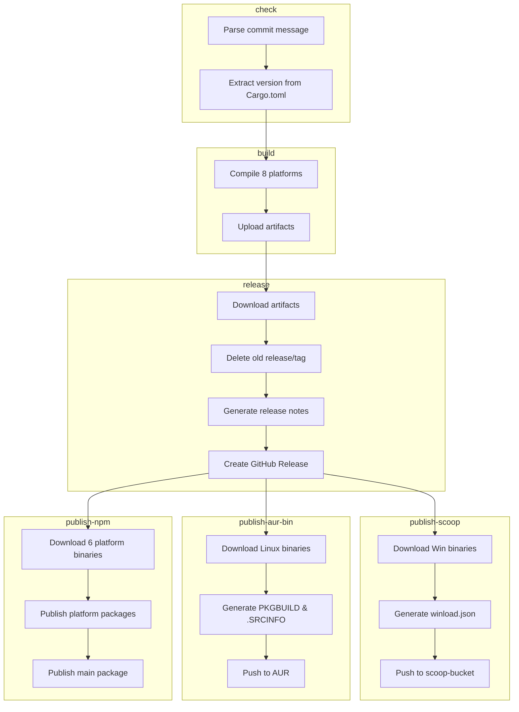

# Build & Release Workflow

> **[📖 English](build.md)**
> **[📖 简体中文(大陆)](build.zh-cn.md)**
> **[📖 繁體中文(台灣)](bulid.zh-tw.md)**

## 📋 Overview

The CI/CD pipeline is driven entirely by **commit message keywords**. Push to `main` with the right keyword and GitHub Actions takes care of the rest.

## 🔑 Keywords

| Keyword in commit message | Build (8 platforms) | GitHub Release | Scoop / AUR / npm | PyPI | crates.io |
|---------------------------|:---:|:---:|:---:|:---:|:---:|
| `build action` | ✅ | ❌ | ❌ | ❌ | ❌ |
| `build release` | ✅ | ✅ | ❌ | ❌ | ❌ |
| `build publish` | ✅ | ✅ | ✅ | ❌ | ❌ |
| `publish from release` | ❌ | ❌ | ✅ | ❌ | ❌ |
| `pypi publish` | ❌ | ❌ | ❌ | ✅ | ❌ |
| `crates publish` | ❌ | ❌ | ❌ | ❌ | ✅ |


> **Note:** `publish from release` fetches binaries from an existing Release without rebuilding. `build publish` does the full pipeline.

> **Note:** Pull Requests always trigger a build (no release or publish). Commit message keywords are **ignored** for PRs — the workflow unconditionally sets `should_build=true`, `should_release=false`, `should_publish=false` and skips keyword parsing entirely.

## 🚀 Usage Examples

```bash
# ============================================================
# Single keyword
# ============================================================

# Just build, verify compilation across all platforms
git commit --allow-empty -m "ci: test cross-compile (build action)"

# Build + create GitHub Release (no package manager publish)
git commit -m "release: v0.2.0 (build release)"

# Only update Scoop bucket from the latest existing Release (no rebuild)
git commit --allow-empty -m "ci: update scoop (publish from release)"

# Publish to crates.io only (no build, no release)
git commit --allow-empty -m "release: v0.2.0 (crates publish)"

# Publish to PyPI only (no build, no release)
git commit --allow-empty -m "release: v0.2.0 (pypi publish)"

# Full pipeline: build + release + publish to Scoop/AUR/npm
git commit -m "release: v0.2.0 (build publish)"

# ============================================================
# Two keywords
# ============================================================

# Build + release + Scoop/AUR/npm + crates.io
git commit --allow-empty -m "release: v0.2.0 (build publish, crates publish)"

# PyPI + crates.io (no build, no release)
git commit --allow-empty -m "release: v0.2.0 (pypi publish, crates publish)"

# Build + release + Scoop/AUR/npm + PyPI
git commit --allow-empty -m "release: v0.2.0 (build publish, pypi publish)"

# ============================================================
# Three keywords
# ============================================================

# Full pipeline: build + release + Scoop/AUR/npm + PyPI + crates.io
git commit --allow-empty -m "release: v0.2.0 (build publish, pypi publish, crates publish)"

# ============================================================
# Regular commits (no build, no publish)
# ============================================================

# Just update documentation
git commit -m "docs: update README"

# Fix a bug
git commit -m "fix: resolve network interface detection issue"

# Add a new feature
git commit -m "feat: add dark mode support"
```

## 🏗️ Build Targets (Rust)

| Platform | Architecture | Target | Notes |
|----------|:---:|--------|-------|
| Windows | x64 | `x86_64-pc-windows-msvc` | Built on Windows x64 runner with native MSVC, mainly for general Windows desktops (mainstream market) |
| Windows | ARM64 | `aarch64-pc-windows-msvc` | Cross-compiled on Windows x64 runner with MSVC, mainly for ARM Windows devices (Snapdragon X Elite/Plus laptops, Surface Pro X etc.) |
| Linux | x64 | `x86_64-unknown-linux-musl` | Built on Ubuntu runner with musl static linking, mainly for all x64 Linux distros (most cloud servers) |
| Linux | ARM64 | `aarch64-unknown-linux-gnu` | Cross-compiled on ubuntu-22.04 with gcc-aarch64, mainly for ARM64 servers / SBCs (RPi etc.) |
| macOS | x64 | `x86_64-apple-darwin` | Built on Apple Silicon runner via Rosetta, mainly for Intel Macs (2020 and earlier) |
| macOS | ARM64 | `aarch64-apple-darwin` | Built natively on Apple Silicon runner, mainly for M-series Macs (all new Macs since late 2020) |
| Android | ARM64 | `aarch64-linux-android` | Cross-compiled on Ubuntu runner with NDK (API 24), mainly for Termux on ARM phones |
| Android | x86_64 | `x86_64-linux-android` | Cross-compiled on Ubuntu runner with NDK (API 24), mainly for emulators / Chromebooks |

## 📦 Pipeline Stages (Rust)

```
check ──→ build ──→ release ──→ publish
  │         │         │           │
  │         │         │           ├─ Scoop: Download Win binaries
  │         │         │           │  Generate winload.json → Push to scoop-bucket
  │         │         │           │
  │         │         │           ├─ AUR: Download Linux binaries
  │         │         │           │  Generate PKGBUILD & .SRCINFO → Push to AUR
  │         │         │           │
  │         │         │           └─ npm: Download 6 platform binaries
  │         │         │              Publish platform packages (os/cpu scoped)
  │         │         │              Publish main package (winload-rust-bin)
  │         │         │
  │         │         └─ Download artifacts
  │         │            Delete old release/tag
  │         │            Generate release notes
  │         │            Create GitHub Release
  │         │
  │         └─ Compile for 8 platform targets
  │            Upload build artifacts
  │
  ├─→ publish-crates-io (after build success, parallel with Scoop/AUR/npm)
  │    cargo publish --allow-dirty
  │
  └─→ publish-pypi (independent, no build needed)
       uv build → uv publish
```



## 🍺 Scoop Publish (Rust)

The `publish` keyword triggers an update to the [scoop-bucket](https://github.com/VincentZyuApps/scoop-bucket) repository:

1. Downloads Windows x64 and ARM64 binaries from the latest GitHub Release
2. Computes SHA256 hashes
3. Generates `winload.json` manifest (with both `64bit` and `arm64` architecture support)
4. Pushes to `VincentZyuApps/scoop-bucket`

## 🐧 AUR Publish (Rust)

The `publish` keyword also triggers an update to the AUR package [winload-rust-bin](https://aur.archlinux.org/packages/winload-rust-bin):

1. Downloads Linux x64 and ARM64 binaries from the latest GitHub Release
2. Computes SHA256 hashes
3. Generates `PKGBUILD` and `.SRCINFO`
4. Pushes to AUR via SSH

### Prerequisite

A repository secret `AUR_SSH_KEY` must be set in **Settings → Secrets → Actions**, containing the private SSH key for the AUR user.

## 📦 npm Publish (Rust)

The `publish` keyword also triggers publishing to npm as [`winload-rust-bin`](https://www.npmjs.com/package/winload-rust-bin):

1. Downloads 6 platform binaries (Win/Linux/macOS × x64/ARM64) from the latest GitHub Release
2. Publishes 6 platform-specific packages with `os`/`cpu` fields (npm auto-selects the matching one)
3. Publishes the main `winload-rust-bin` package with `optionalDependencies`
4. All versions (including pre-release like `0.1.6-beta.4`) are published as `latest`

> Uses the [esbuild](https://github.com/evanw/esbuild) / [Biome](https://github.com/biomejs/biome) pattern: each platform has its own scoped package, `optionalDependencies` ensures only the matching binary is downloaded.

### Prerequisite

A repository secret `NPM_TOKEN` must be set in **Settings → Secrets → Actions**, containing an npm Automation token.

## 🐍 PyPI Publish (Python)

The `pypi publish` keyword triggers publishing the Python package to PyPI:

1. Installs `uv` via [astral-sh/setup-uv](https://github.com/astral-sh/setup-uv)
2. Builds the package using `uv build` in the `py/` directory
3. Publishes to PyPI using `uv publish`

### Prerequisite

A repository secret `PYPI_TOKEN` must be set in **Settings → Secrets → Actions**, containing a PyPI API token with "Entire account" scope.

## 📦 crates.io Publish (Rust)

The `crates publish` keyword triggers publishing the Rust crate to [crates.io](https://crates.io/crates/winload):

1. Installs Rust stable toolchain
2. Runs `cargo publish --allow-dirty` to publish to crates.io
3. Users can install via `cargo install winload`

### Prerequisite

A repository secret `CARGO_REGISTRY_TOKEN` must be set in **Settings → Secrets → Actions**, containing a crates.io API token.

> **Note:** This job runs in parallel with Scoop/AUR/npm after the build completes, ensuring the compiled binary is ready before publishing.

## 📌 Version

The version is automatically extracted from `rust/Cargo.toml` (Rust) or `py/pyproject.toml` (Python) and used for:
- Release tag name (e.g. `v0.1.5`)
- Artifact filenames (e.g. `winload-windows-x86_64-v0.1.5.exe`)
- Scoop/AUR/npm/PyPI/crates.io manifest version field

> **Note:** The npm package version also comes from `rust/Cargo.toml`. During CI, the `publish-npm` job dynamically injects the version into `package.json` — the `0.0.0` placeholder in the repository is never published.

## ⚙️ Prerequisites Summary

| Secret | Where to get | Purpose |
|--------|--------------|---------|
| `SCOOP_BUCKET_TOKEN` | GitHub PAT with `repo` scope | Push to Scoop bucket |
| `AUR_SSH_KEY` | AUR user SSH private key | Push to AUR |
| `NPM_TOKEN` | npm Automation token | Publish to npm |
| `PYPI_TOKEN` | PyPI API token (Scope: "Entire account") | Push to PyPI |
| `CARGO_REGISTRY_TOKEN` | crates.io API token | Publish to crates.io |
