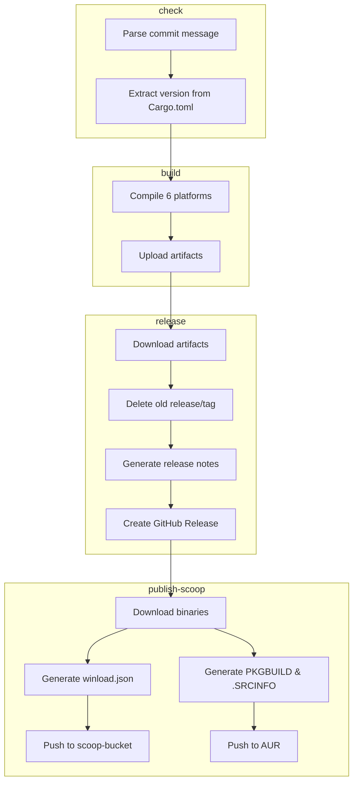

# Build & Release Workflow

> **[📖 English](build.md)**
> **[📖 简体中文(大陆)](build.zh-cn.md)**
> **[📖 繁體中文(台灣)](bulid.zh-tw.md)**

## 📋 Overview

The CI/CD pipeline is driven entirely by **commit message keywords**. Push to `main` with the right keyword and GitHub Actions takes care of the rest.

## 🔑 Keywords

| Keyword in commit message | Build (6 platforms) | GitHub Release | Scoop Bucket | PyPI |
|---------------------------|:---:|:---:|:---:|:---:|
| *(none)* | ❌ | ❌ | ❌ | ❌ |
| `build action` | ✅ | ❌ | ❌ | ❌ |
| `build release` | ✅ | ✅ | ❌ | ❌ |
| `publish from release` | ❌ | ❌ | ✅ | ❌ |
| `build publish` | ✅ | ✅ | ✅ | ❌ |
| `pypi publish` | ❌ | ❌ | ❌ | ✅ |

> **Note:** `publish from release` fetches binaries from an existing Release without rebuilding. `build publish` does the full pipeline.

> **Note:** Pull Requests always trigger a build (no release or publish). Commit message keywords are **ignored** for PRs — the workflow unconditionally sets `should_build=true`, `should_release=false`, `should_publish=false` and skips keyword parsing entirely.

## 🚀 Usage Examples

```bash
# Just build, verify compilation across all platforms
git commit --allow-empty -m "ci: test cross-compile (build action)"

# Build + create GitHub Release with artifacts
git commit -m "release: v0.2.0 (build release)"

# Only update Scoop bucket from the latest existing Release (no rebuild)
git commit --allow-empty -m "ci: update scoop (publish from release)"

# Full pipeline: build + release + publish to Scoop
git commit -m "release: v0.2.0 (build publish)"

# Publish to PyPI only (no build, no release)
git commit --allow-empty -m "release: v0.2.0 (pypi publish)"
```

## 🏗️ Build Targets (Rust)

| Platform | Architecture | Target | Notes |
|----------|:---:|--------|-------|
| Windows | x64 | `x86_64-pc-windows-msvc` | Native MSVC |
| Windows | ARM64 | `aarch64-pc-windows-msvc` | Cross-compiled on x64 runner |
| Linux | x64 | `x86_64-unknown-linux-musl` | Static linking (musl), portable |
| Linux | ARM64 | `aarch64-unknown-linux-gnu` | Built on ubuntu-22.04 for lower GLIBC |
| macOS | x64 | `x86_64-apple-darwin` | Built on Apple Silicon runner |
| macOS | ARM64 | `aarch64-apple-darwin` | Native Apple Silicon |

## 📦 Pipeline Stages (Rust)

```
check ──→ build ──→ release ──→ publish-scoop
  │         │         │              │
  │         │         │              ├─ Download binaries from Release
  │         │         │              │  Generate winload.json
  │         │         │              │  Push to scoop-bucket
  │         │         │              │
  │         │         │              └─ Download binaries from Release
  │         │         │                 Generate PKGBUILD & .SRCINFO
  │         │         │                 Push to AUR
  │         │         │
  │         │         └─ Download artifacts
  │         │            Delete old release/tag
  │         │            Generate release notes
  │         │            Create GitHub Release
  │         │
  │         └─ Compile for 6 platform targets
  │            Upload build artifacts
  │
  └─ Parse commit message keywords
     Extract version from Cargo.toml
```


check ──→ build ──→ release ──→ publish-scoop
  │         │         │              │
  │         │         │              ├─ Download binaries from Release
  │         │         │              │  Generate winload.json
  │         │         │              │  Push to scoop-bucket repo
  │         │         │              │
  │         │         │              └─ Download binaries from Release
  │         │         │                 Generate PKGBUILD & .SRCINFO
  │         │         │                 Push to AUR
  │         │         │
  │         │         └─ Download artifacts
  │         │            Delete old release/tag
  │         │            Generate release notes
  │         │            Create GitHub Release
  │         │
  │         └─ Compile for 6 platform targets
  │            Upload build artifacts
  │
  └─ Parse commit message keywords
     Extract version from Cargo.toml
```

## 🍺 Scoop Publish (Rust)

The `publish` keyword triggers an update to the [scoop-bucket](https://github.com/VincentZyuApps/scoop-bucket) repository:

1. Downloads Windows x64 and ARM64 binaries from the latest GitHub Release
2. Computes SHA256 hashes
3. Generates `winload.json` manifest (with both `64bit` and `arm64` architecture support)
4. Pushes to `VincentZyuApps/scoop-bucket`

## 🐧 AUR Publish (Rust)

The `publish` keyword also triggers an update to the AUR package [winload-rust-bin](https://aur.archlinux.org/packages/winload-rust-bin):

1. Downloads Linux x64 and ARM64 binaries from the latest GitHub Release
2. Computes SHA256 hashes
3. Generates `PKGBUILD` and `.SRCINFO`
4. Pushes to AUR via SSH

### Prerequisite

A repository secret `AUR_SSH_KEY` must be set in **Settings → Secrets → Actions**, containing the private SSH key for the AUR user.

## 🐍 PyPI Publish (Python)

The `pypi publish` keyword triggers publishing the Python package to PyPI:

1. Installs `uv` via [astral-sh/setup-uv](https://github.com/astral-sh/setup-uv)
2. Builds the package using `uv build` in the `py/` directory
3. Publishes to PyPI using `uv publish`

### Prerequisite

A repository secret `PYPI_TOKEN` must be set in **Settings → Secrets → Actions**, containing a PyPI API token with "Entire account" scope.

## 📌 Version

The version is automatically extracted from `rust/Cargo.toml` (Rust) or `py/pyproject.toml` (Python) and used for:
- Release tag name (e.g. `v0.1.5`)
- Artifact filenames (e.g. `winload-windows-x86_64-v0.1.5.exe`)
- Scoop/AUR/PyPI manifest version field

## ⚙️ Prerequisites Summary

| Secret | Where to get | Purpose |
|--------|--------------|---------|
| `SCOOP_BUCKET_TOKEN` | GitHub PAT with `repo` scope | Push to Scoop bucket |
| `AUR_SSH_KEY` | AUR user SSH private key | Push to AUR |
| `PYPI_TOKEN` | PyPI API token (Scope: "Entire account") | Push to PyPI |
