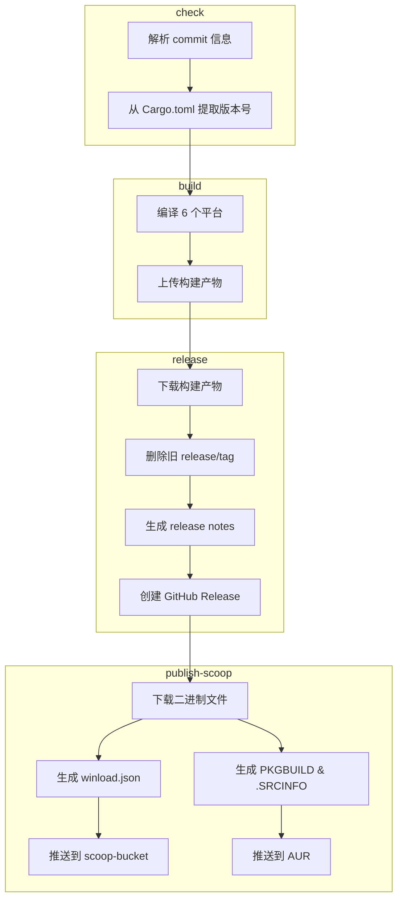

# 构建与发布工作流

> **[📖 English](build.md)**
> **[📖 简体中文(大陆)](build.zh-cn.md)**
> **[📖 繁體中文(台灣)](bulid.zh-tw.md)**

## 📋 概述

CI/CD 流水线完全由 **commit 信息中的关键词** 驱动。推送到 `main` 分支时，只需在 commit message 中包含对应关键词，GitHub Actions 会自动完成后续工作。

## 🔑 关键词

| Commit 信息中的关键词 | 构建（6 平台） | GitHub Release | Scoop Bucket | PyPI |
|----------------------|:---:|:---:|:---:|:---:|
| *（无关键词）* | ❌ | ❌ | ❌ | ❌ |
| `build action` | ✅ | ❌ | ❌ | ❌ |
| `build release` | ✅ | ✅ | ❌ | ❌ |
| `publish from release` | ❌ | ❌ | ✅ | ❌ |
| `build publish` | ✅ | ✅ | ✅ | ❌ |
| `pypi publish` | ❌ | ❌ | ❌ | ✅ |

> **说明:** `publish from release` 从已有的 Release 拉取二进制发布，不会重新构建。`build publish` 则是完整流水线。

> **说明:** Pull Request 始终会触发构建（不会发布或推送包管理器）。PR 中 commit message 的关键词会被**忽略**——工作流会无条件设置 `should_build=true`、`should_release=false`、`should_publish=false`，并跳过关键词解析。

## 🚀 用法示例

```bash
# 仅构建，验证所有平台的编译
git commit --allow-empty -m "ci: test cross-compile (build action)"

# 构建 + 创建 GitHub Release
git commit -m "release: v0.2.0 (build release)"

# 仅更新 Scoop bucket（从已有的最新 Release 拉取二进制，不重新构建）
git commit --allow-empty -m "ci: update scoop (publish from release)"

# 完整流水线：构建 + 发布 Release + 推送 Scoop
git commit -m "release: v0.2.0 (build publish)"

# 仅发布到 PyPI（不构建，不发布 Release）
git commit --allow-empty -m "release: v0.2.0 (pypi publish)"
```

## 🏗️ 构建目标 (Rust)

| 平台 | 架构 | Target | 说明 |
|------|:---:|--------|------|
| Windows | x64 | `x86_64-pc-windows-msvc` | 原生 MSVC 编译 |
| Windows | ARM64 | `aarch64-pc-windows-msvc` | 在 x64 runner 上交叉编译 |
| Linux | x64 | `x86_64-unknown-linux-musl` | musl 静态链接，可移植 |
| Linux | ARM64 | `aarch64-unknown-linux-gnu` | 在 ubuntu-22.04 上编译，降低 GLIBC 要求 |
| macOS | x64 | `x86_64-apple-darwin` | 在 Apple Silicon runner 上编译 |
| macOS | ARM64 | `aarch64-apple-darwin` | 原生 Apple Silicon |

## 📦 流水线阶段 (Rust)

```
check ──→ build ──→ release ──→ publish-scoop
  │         │         │              │
  │         │         │              ├─ 从 Release 下载二进制
  │         │         │              │  生成 winload.json
  │         │         │              │  推送到 scoop-bucket 仓库
  │         │         │              │
  │         │         │              └─ 从 Release 下载二进制
  │         │         │                 生成 PKGBUILD & .SRCINFO
  │         │         │                 推送到 AUR
  │         │         │
  │         │         └─ 下载构建产物
  │         │            删除旧的 release/tag
  │         │            生成 release notes
  │         │            创建 GitHub Release
  │         │
  │         └─ 编译 6 个平台目标
  │            上传构建产物
  │
  └─ 解析 commit 信息关键词
     从 Cargo.toml 提取版本号
```



## 🍺 Scoop 发布 (Rust)

`publish` 关键词会触发 [scoop-bucket](https://github.com/VincentZyuApps/scoop-bucket) 仓库的更新：

1. 从最新的 GitHub Release 下载 Windows x64 和 ARM64 二进制文件
2. 计算 SHA256 哈希值
3. 生成 `winload.json` 清单文件（包含 `64bit` 和 `arm64` 两种架构）
4. 推送到 `VincentZyuApps/scoop-bucket` 仓库

## 🐧 AUR 发布 (Rust)

`publish` 关键词也会触发 AUR 包 [winload-rust-bin](https://aur.archlinux.org/packages/winload-rust-bin) 的更新：

1. 从最新的 GitHub Release 下载 Linux x64 和 ARM64 二进制文件
2. 计算 SHA256 哈希值
3. 生成 `PKGBUILD` 和 `.SRCINFO`
4. 通过 SSH 推送到 AUR

### 前置条件

需要在仓库的 **Settings → Secrets → Actions** 中设置 `AUR_SSH_KEY` 密钥，值为 AUR 用户的 SSH 私钥。

## 🐍 PyPI 发布 (Python)

`pypi publish` 关键词会触发将 Python 包发布到 PyPI：

1. 通过 [astral-sh/setup-uv](https://github.com/astral-sh/setup-uv) 安装 `uv`
2. 在 `py/` 目录下使用 `uv build` 构建包
3. 使用 `uv publish` 发布到 PyPI

### 前置条件

需要在仓库的 **Settings → Secrets → Actions** 中设置 `PYPI_TOKEN` 密钥，值为一个拥有 "Entire account" 权限的 PyPI API Token。

## 📌 版本号

版本号自动从 `rust/Cargo.toml` (Rust) 或 `py/pyproject.toml` (Python) 中提取，用于：
- Release 标签名（如 `v0.1.5`）
- 产物文件名（如 `winload-windows-x86_64-v0.1.5.exe`）
- Scoop/AUR/PyPI 清单文件中的版本字段

## ⚙️ 前置条件汇总

| 密钥 | 获取方式 | 用途 |
|------|----------|------|
| `SCOOP_BUCKET_TOKEN` | GitHub PAT（需 `repo` 权限） | 推送到 Scoop bucket |
| `AUR_SSH_KEY` | AUR 用户 SSH 私钥 | 推送到 AUR |
| `PYPI_TOKEN` | PyPI API Token（Scope: "Entire account"） | 推送到 PyPI |
