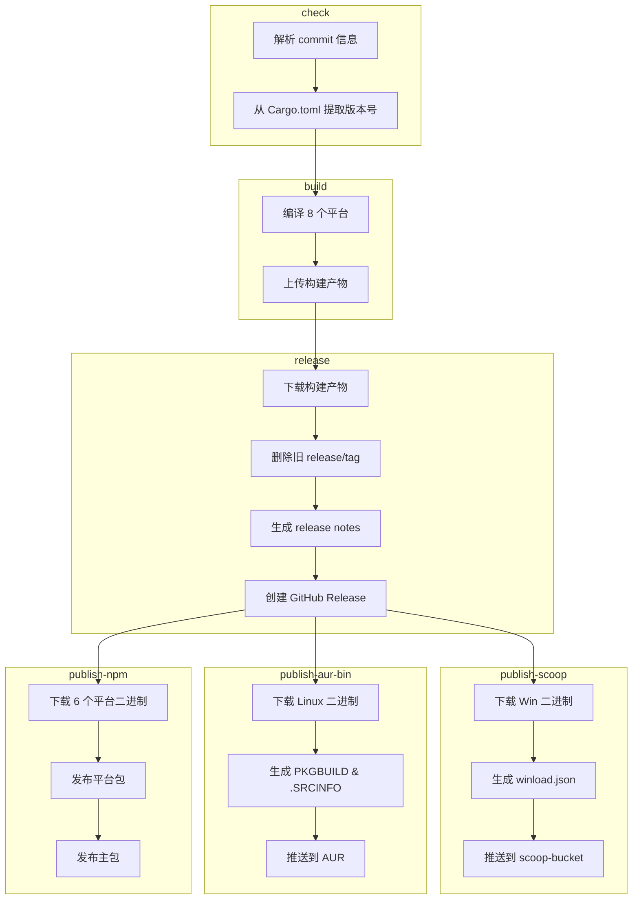

# 构建与发布工作流

> **[📖 English](build.md)**
> **[📖 简体中文(大陆)](build.zh-cn.md)**
> **[📖 繁體中文(台灣)](bulid.zh-tw.md)**

## 📋 概述

CI/CD 流水线完全由 **commit 信息中的关键词** 驱动。推送到 `main` 分支时，只需在 commit message 中包含对应关键词，GitHub Actions 会自动完成后续工作。

## 🔑 关键词

| Commit 信息中的关键词 | 构建（8 平台） | GitHub Release | Scoop / AUR / npm | PyPI | crates.io |
|----------------------|:---:|:---:|:---:|:---:|:---:|
| `build action` | ✅ | ❌ | ❌ | ❌ | ❌ |
| `build release` | ✅ | ✅ | ❌ | ❌ | ❌ |
| `build publish` | ✅ | ✅ | ✅ | ❌ | ❌ |
| `publish from release` | ❌ | ❌ | ✅ | ❌ | ❌ |
| `pypi publish` | ❌ | ❌ | ❌ | ✅ | ❌ |
| `crates publish` | ❌ | ❌ | ❌ | ❌ | ✅ |


> **说明:** `publish from release` 从已有的 Release 拉取二进制发布，不会重新构建。`build publish` 则是完整流水线。

> **说明:** Pull Request 始终会触发构建（不会发布或推送包管理器）。PR 中 commit message 的关键词会被**忽略**——工作流会无条件设置 `should_build=true`、`should_release=false`、`should_publish=false`，并跳过关键词解析。

## 🚀 用法示例

```bash
# ============================================================
# 单个关键词
# ============================================================

# 仅构建，验证所有平台的编译
git commit --allow-empty -m "ci: test cross-compile (build action)"

# 构建 + 创建 GitHub Release（不发布到包管理器）
git commit -m "release: v0.2.0 (build release)"

# 仅更新 Scoop bucket（从已有的最新 Release 拉取二进制，不重新构建）
git commit --allow-empty -m "ci: update scoop (publish from release)"

# 仅发布到 crates.io（不构建，不发布 Release）
git commit --allow-empty -m "release: v0.2.0 (crates publish)"

# 仅发布到 PyPI（不构建，不发布 Release）
git commit --allow-empty -m "release: v0.2.0 (pypi publish)"

# 完整流水线：构建 + Release + 发布到 Scoop/AUR/npm
git commit -m "release: v0.2.0 (build publish)"

# ============================================================
# 两个关键词组合
# ============================================================

# 构建 + Release + Scoop/AUR/npm + crates.io
git commit --allow-empty -m "release: v0.2.0 (build publish, crates publish)"

# PyPI + crates.io（不构建，不发布 Release）
git commit --allow-empty -m "release: v0.2.0 (pypi publish, crates publish)"

# 构建 + Release + Scoop/AUR/npm + PyPI
git commit --allow-empty -m "release: v0.2.0 (build publish, pypi publish)"

# ============================================================
# 三个关键词组合
# ============================================================

# 完整流水线：构建 + Release + Scoop/AUR/npm + PyPI + crates.io
git commit --allow-empty -m "release: v0.2.0 (build publish, pypi publish, crates publish)"

# ============================================================
# 常规 commit（不需要构建和发布）
# ============================================================

# 仅更新文档
git commit -m "docs: update README"

# 修复 bug
git commit -m "fix: resolve network interface detection issue"

# 添加新功能
git commit -m "feat: add dark mode support"
```

## 🏗️ 构建目标 (Rust)

| 平台 | 架构 | Target | 说明 |
|------|:---:|--------|------|
| Windows | x64 | `x86_64-pc-windows-msvc` | 在 Windows x64 runner 上用原生 MSVC 编译，主要用于一般 Windows 桌面（桌面市场主流） |
| Windows | ARM64 | `aarch64-pc-windows-msvc` | 在 Windows x64 runner 上用 MSVC 交叉编译，主要用于 ARM Windows 设备（高通骁龙 X Elite/Plus 笔记本、Surface Pro X 等） |
| Linux | x64 | `x86_64-unknown-linux-musl` | 在 Ubuntu runner 上用 musl 静态链接编译，主要用于所有 x64 Linux 发行版（大部分云服务器） |
| Linux | ARM64 | `aarch64-unknown-linux-gnu` | 在 ubuntu-22.04 上用 gcc-aarch64 交叉编译，主要用于 ARM64 服务器 / 单片机（树莓派等） |
| macOS | x64 | `x86_64-apple-darwin` | 在 Apple Silicon runner 上通过 Rosetta 编译，主要用于 Intel Mac（2020 年及更早的老款 Mac） |
| macOS | ARM64 | `aarch64-apple-darwin` | 在 Apple Silicon runner 上原生编译，主要用于 M 系列 Mac（2020 年末至今的所有新款 Mac） |
| Android | ARM64 | `aarch64-linux-android` | 在 Ubuntu runner 上用 NDK（API 24）交叉编译，主要用于 Termux（ARM 手机） |
| Android | x86_64 | `x86_64-linux-android` | 在 Ubuntu runner 上用 NDK（API 24）交叉编译，主要用于模拟器 / Chromebook |

## 📦 流水线阶段 (Rust)

```
check ──→ build ──→ release ──→ publish
  │         │         │           │
  │         │         │           ├─ Scoop: 从 Release 下载 Win 二进制
  │         │         │           │  生成 winload.json → 推送到 scoop-bucket
  │         │         │           │
  │         │         │           ├─ AUR: 从 Release 下载 Linux 二进制
  │         │         │           │  生成 PKGBUILD & .SRCINFO → 推送到 AUR
  │         │         │           │
  │         │         │           └─ npm: 从 Release 下载 6 个平台二进制
  │         │         │              发布平台包 (os/cpu 限定)
  │         │         │              发布主包 (winload-rust-bin)
  │         │         │
  │         │         └─ 下载构建产物
  │         │            删除旧的 release/tag
  │         │            生成 release notes
  │         │            创建 GitHub Release
  │         │
  │         └─ 编译 8 个平台目标
  │            上传构建产物
  │
  ├─→ publish-crates-io（构建成功后并行，与 Scoop/AUR/npm 同时）
  │    cargo publish --allow-dirty
  │
  └─→ publish-pypi（独立运行，不需要构建）
       uv build → uv publish
```



## 🍺 Scoop 发布 (Rust)

`publish` 关键词会触发 [scoop-bucket](https://github.com/VincentZyuApps/scoop-bucket) 仓库的更新：

1. 从最新的 GitHub Release 下载 Windows x64 和 ARM64 二进制文件
2. 计算 SHA256 哈希值
3. 生成 `winload.json` 清单文件（包含 `64bit` 和 `arm64` 两种架构）
4. 推送到 `VincentZyuApps/scoop-bucket` 仓库

## 🐧 AUR 发布 (Rust)

`publish` 关键词也会触发 AUR 包 [winload-rust-bin](https://aur.archlinux.org/packages/winload-rust-bin) 的更新：

1. 从最新的 GitHub Release 下载 Linux x64 和 ARM64 二进制文件
2. 计算 SHA256 哈希值
3. 生成 `PKGBUILD` 和 `.SRCINFO`
4. 通过 SSH 推送到 AUR

### 前置条件

需要在仓库的 **Settings → Secrets → Actions** 中设置 `AUR_SSH_KEY` 密钥，值为 AUR 用户的 SSH 私钥。

## 📦 npm 发布 (Rust)

`publish` 关键词也会触发将 Rust 预编译二进制发布到 npm，包名为 [`winload-rust-bin`](https://www.npmjs.com/package/winload-rust-bin)：

1. 从最新的 GitHub Release 下载 6 个平台的二进制文件（Win/Linux/macOS × x64/ARM64）
2. 发布 6 个平台专属包，每个包带有 `os`/`cpu` 字段（npm 自动选择匹配的包）
3. 发布主包 `winload-rust-bin`，通过 `optionalDependencies` 引用各平台包
4. 所有版本（包括预发布如 `0.1.6-beta.4`）均以 `latest` 标签发布

> 采用 [esbuild](https://github.com/evanw/esbuild) / [Biome](https://github.com/biomejs/biome) 模式：每个平台一个独立包，`optionalDependencies` 确保只下载匹配当前平台的二进制。

### 前置条件

需要在仓库的 **Settings → Secrets → Actions** 中设置 `NPM_TOKEN` 密钥，值为 npm Automation Token。

## 🐍 PyPI 发布 (Python)

`pypi publish` 关键词会触发将 Python 包发布到 PyPI：

1. 通过 [astral-sh/setup-uv](https://github.com/astral-sh/setup-uv) 安装 `uv`
2. 在 `py/` 目录下使用 `uv build` 构建包
3. 使用 `uv publish` 发布到 PyPI

### 前置条件

需要在仓库的 **Settings → Secrets → Actions** 中设置 `PYPI_TOKEN` 密钥，值为一个拥有 "Entire account" 权限的 PyPI API Token。

## 📦 crates.io 发布 (Rust)

`crates publish` 关键词会触发将 Rust 包发布到 [crates.io](https://crates.io/crates/winload)：

1. 安装 Rust stable 工具链
2. 运行 `cargo publish --allow-dirty` 发布到 crates.io
3. 用户可以通过 `cargo install winload` 安装

### 前置条件

需要在仓库的 **Settings → Secrets → Actions** 中设置 `CARGO_REGISTRY_TOKEN` 密钥，值为 crates.io API Token。

> **注意：** 此任务在构建成功后与 Scoop/AUR/npm 并行运行，确保编译产物准备好后再发布。

## 📌 版本号

版本号自动从 `rust/Cargo.toml` (Rust) 或 `py/pyproject.toml` (Python) 中提取，用于：
- Release 标签名（如 `v0.1.5`）
- 产物文件名（如 `winload-windows-x86_64-v0.1.5.exe`）
- Scoop/AUR/npm/PyPI/crates.io 清单文件中的版本字段

> **注意：** npm 包的版本号同样来自 `rust/Cargo.toml`。CI 中 `publish-npm` 任务会在发布前将版本号动态注入 `package.json` —— 仓库中的 `0.0.0` 占位符不会被发布。

## ⚙️ 前置条件汇总

| 密钥 | 获取方式 | 用途 |
|------|----------|------|
| `SCOOP_BUCKET_TOKEN` | GitHub PAT（需 `repo` 权限） | 推送到 Scoop bucket |
| `AUR_SSH_KEY` | AUR 用户 SSH 私钥 | 推送到 AUR |
| `NPM_TOKEN` | npm Automation Token | 发布到 npm |
| `PYPI_TOKEN` | PyPI API Token（Scope: "Entire account"） | 推送到 PyPI |
| `CARGO_REGISTRY_TOKEN` | crates.io API Token | 发布到 crates.io |
