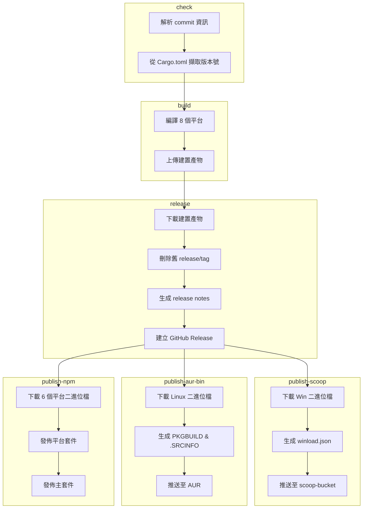

# 建置與發佈工作流

> **[📖 English](build.md)**
> **[📖 简体中文(大陆)](build.zh-cn.md)**
> **[📖 繁體中文(台灣)](bulid.zh-tw.md)**

## 📋 概述

CI/CD 流程完全由 **commit 資訊中的關鍵字** 驅動。推送至 `main` 分支時，只需在 commit message 中包含對應關鍵字，GitHub Actions 就會自動完成後續作業。

## 🔑 關鍵字

| Commit 資訊中的關鍵字 | 建置（8 平台） | GitHub Release | Scoop / AUR / npm | PyPI | crates.io |
|----------------------|:---:|:---:|:---:|:---:|:---:|
| `build action` | ✅ | ❌ | ❌ | ❌ | ❌ |
| `build release` | ✅ | ✅ | ❌ | ❌ | ❌ |
| `build publish` | ✅ | ✅ | ✅ | ❌ | ❌ |
| `publish from release` | ❌ | ❌ | ✅ | ❌ | ❌ |
| `pypi publish` | ❌ | ❌ | ❌ | ✅ | ❌ |
| `crates publish` | ❌ | ❌ | ❌ | ❌ | ✅ |


> **說明:** `publish from release` 從現有的 Release 抓取二進位檔發布，不會重新建置。`build publish` 則是完整的流程。

> **說明:** Pull Request 都會觸發建置（不會發布或推送套件管理工具）。PR 中 commit message 的關鍵字會被**忽略**——工作流程會無條件設定 `should_build=true`、`should_release=false`、`should_publish=false`，並跳過關鍵字解析。

## 🚀 用法範例

```bash
# ============================================================
# 單個關鍵字
# ============================================================

# 僅建置，驗證所有平台的編譯
git commit --allow-empty -m "ci: test cross-compile (build action)"

# 建置 + 建立 GitHub Release（不發佈至套件管理工具）
git commit -m "release: v0.2.0 (build release)"

# 僅更新 Scoop bucket（從現有的最新 Release 抓取二進位檔，不重新建置）
git commit --allow-empty -m "ci: update scoop (publish from release)"

# 僅發布至 crates.io（不建置，不發布 Release）
git commit --allow-empty -m "release: v0.2.0 (crates publish)"

# 僅發布至 PyPI（不建置，不發布 Release）
git commit --allow-empty -m "release: v0.2.0 (pypi publish)"

# 完整流程：建置 + Release + 發布至 Scoop/AUR/npm
git commit -m "release: v0.2.0 (build publish)"

# ============================================================
# 兩個關鍵字組合
# ============================================================

# 建置 + Release + Scoop/AUR/npm + crates.io
git commit --allow-empty -m "release: v0.2.0 (build publish, crates publish)"

# PyPI + crates.io（不建置，不發布 Release）
git commit --allow-empty -m "release: v0.2.0 (pypi publish, crates publish)"

# 建置 + Release + Scoop/AUR/npm + PyPI
git commit --allow-empty -m "release: v0.2.0 (build publish, pypi publish)"

# ============================================================
# 三個關鍵字組合
# ============================================================

# 完整流程：建置 + Release + Scoop/AUR/npm + PyPI + crates.io
git commit --allow-empty -m "release: v0.2.0 (build publish, pypi publish, crates publish)"

# ============================================================
# 常規 commit（不需要建置和發布）
# ============================================================

# 僅更新文件
git commit -m "docs: update README"

# 修復錯誤
git commit -m "fix: resolve network interface detection issue"

# 新增功能
git commit -m "feat: add dark mode support"
```

## 🏗️ 建置目標 (Rust)

| 平台 | 架構 | Target | 說明 |
|------|:---:|--------|------|
| Windows | x64 | `x86_64-pc-windows-msvc` | 在 Windows x64 runner 上用原生 MSVC 編譯，主要用於一般 Windows 桌面（桌面市場主流） |
| Windows | ARM64 | `aarch64-pc-windows-msvc` | 在 Windows x64 runner 上用 MSVC 交叉編譯，主要用於 ARM Windows 裝置（高通驍龍 X Elite/Plus 筆電、Surface Pro X 等） |
| Linux | x64 | `x86_64-unknown-linux-musl` | 在 Ubuntu runner 上用 musl 靜態連結編譯，主要用於所有 x64 Linux 發行版（大部分雲端伺服器） |
| Linux | ARM64 | `aarch64-unknown-linux-gnu` | 在 ubuntu-22.04 上用 gcc-aarch64 交叉編譯，主要用於 ARM64 伺服器 / 單板機（樹莓派等） |
| macOS | x64 | `x86_64-apple-darwin` | 在 Apple Silicon runner 上透過 Rosetta 編譯，主要用於 Intel Mac（2020 年及更早的舁款 Mac） |
| macOS | ARM64 | `aarch64-apple-darwin` | 在 Apple Silicon runner 上原生編譯，主要用於 M 系列 Mac（2020 年底至今的所有新款 Mac） |
| Android | ARM64 | `aarch64-linux-android` | 在 Ubuntu runner 上用 NDK（API 24）交叉編譯，主要用於 Termux（ARM 手機） |
| Android | x86_64 | `x86_64-linux-android` | 在 Ubuntu runner 上用 NDK（API 24）交叉編譯，主要用於模擬器 / Chromebook |

## 📦 流程階段 (Rust)

```
check ──→ build ──→ release ──→ publish
  │         │         │           │
  │         │         │           ├─ Scoop: 從 Release 下載 Win 二進位檔
  │         │         │           │  生成 winload.json → 推送至 scoop-bucket
  │         │         │           │
  │         │         │           ├─ AUR: 從 Release 下載 Linux 二進位檔
  │         │         │           │  生成 PKGBUILD & .SRCINFO → 推送至 AUR
  │         │         │           │
  │         │         │           └─ npm: 從 Release 下載 6 個平台二進位檔
  │         │         │              發佈平台套件 (os/cpu 限定)
  │         │         │              發佈主套件 (winload-rust-bin)
  │         │         │
  │         │         └─ 下載建置產物
  │         │            刪除舊的 release/tag
  │         │            生成 release notes
  │         │            建立 GitHub Release
  │         │
  │         └─ 編譯 8 個平台目標
  │            上傳建置產物
  │
  ├─→ publish-crates-io（建置成功後並行，與 Scoop/AUR/npm 同時）
  │    cargo publish --allow-dirty
  │
  └─→ publish-pypi（獨立運行，不需要建置）
       uv build → uv publish
```



## 🍺 Scoop 發佈 (Rust)

`publish` 關鍵字會觸發 [scoop-bucket](https://github.com/VincentZyuApps/scoop-bucket) 儲存庫的更新：

1. 從最新的 GitHub Release 下載 Windows x64 和 ARM64 二進位檔案
2. 計算 SHA256 雜湊值
3. 生成 `winload.json` 清單檔案（包含 `64bit` 和 `arm64` 兩種架構）
4. 推送至 `VincentZyuApps/scoop-bucket` 儲存庫

## 🐧 AUR 發佈 (Rust)

`publish` 關鍵字也會觸發 AUR 套件 [winload-rust-bin](https://aur.archlinux.org/packages/winload-rust-bin) 的更新：

1. 從最新的 GitHub Release 下載 Linux x64 和 ARM64 二進位檔案
2. 計算 SHA256 雜湊值
3. 生成 `PKGBUILD` 和 `.SRCINFO`
4. 透過 SSH 推送至 AUR

### 前置條件

需在儲存庫的 **Settings → Secrets → Actions** 中設定 `AUR_SSH_KEY` 金鑰，值為 AUR 使用者的 SSH 私密金鑰。

## 📦 npm 發佈 (Rust)

`publish` 關鍵字也會觸發將 Rust 預編譯二進位檔發佈至 npm，套件名為 [`winload-rust-bin`](https://www.npmjs.com/package/winload-rust-bin)：

1. 從最新的 GitHub Release 下載 6 個平台的二進位檔案（Win/Linux/macOS × x64/ARM64）
2. 發佈 6 個平台專屬套件，每個套件帶有 `os`/`cpu` 欄位（npm 自動選擇匹配的套件）
3. 發佈主套件 `winload-rust-bin`，透過 `optionalDependencies` 引用各平台套件
4. 所有版本（包括預發佈如 `0.1.6-beta.4`）均以 `latest` 標籤發佈

> 採用 [esbuild](https://github.com/evanw/esbuild) / [Biome](https://github.com/biomejs/biome) 模式：每個平台一個獨立套件，`optionalDependencies` 確保只下載匹配當前平台的二進位檔。

### 前置條件

需在儲存庫的 **Settings → Secrets → Actions** 中設定 `NPM_TOKEN` 金鑰，值為 npm Automation Token。

## 🐍 PyPI 發佈 (Python)

`pypi publish` 關鍵字會觸發將 Python 套件發佈至 PyPI：

1. 透過 [astral-sh/setup-uv](https://github.com/astral-sh/setup-uv) 安裝 `uv`
2. 在 `py/` 目錄下使用 `uv build` 建置套件
3. 使用 `uv publish` 發佈至 PyPI

### 前置條件

需在儲存庫的 **Settings → Secrets → Actions** 中設定 `PYPI_TOKEN` 金鑰，值為具備 "Entire account" 權限的 PyPI API Token。

## 📦 crates.io 發佈 (Rust)

`crates publish` 關鍵字會觸發將 Rust 套件發佈至 [crates.io](https://crates.io/crates/winload)：

1. 安裝 Rust stable 工具鏈
2. 執行 `cargo publish --allow-dirty` 發佈至 crates.io
3. 使用者可以透過 `cargo install winload` 安裝

### 前置條件

需在儲存庫的 **Settings → Secrets → Actions** 中設定 `CARGO_REGISTRY_TOKEN` 金鑰，值為 crates.io API Token。

> **注意：** 此任務在建置成功後與 Scoop/AUR/npm 並行運行，確保編譯產物準備好後再發佈。

## 📌 版本號

版本號自動從 `rust/Cargo.toml` (Rust) 或 `py/pyproject.toml` (Python) 中擷取，用於：
- Release 標籤名（如 `v0.1.5`）
- 產物檔名（如 `winload-windows-x86_64-v0.1.5.exe`）
- Scoop/AUR/npm/PyPI/crates.io 清單檔案中的版本欄位

> **注意：** npm 套件的版本號同樣來自 `rust/Cargo.toml`。CI 中 `publish-npm` 任務會在發佈前將版本號動態注入 `package.json` —— 儲存庫中的 `0.0.0` 佔位符不會被發佈。

## ⚙️ 前置條件彙總

| 金鑰 | 取得方式 | 用途 |
|------|----------|------|
| `SCOOP_BUCKET_TOKEN` | GitHub PAT（需 `repo` 權限） | 推送至 Scoop bucket |
| `AUR_SSH_KEY` | AUR 使用者 SSH 私密金鑰 | 推送至 AUR |
| `NPM_TOKEN` | npm Automation Token | 發佈至 npm |
| `PYPI_TOKEN` | PyPI API Token（Scope: "Entire account"） | 推送至 PyPI |
| `CARGO_REGISTRY_TOKEN` | crates.io API Token | 發佈至 crates.io |
