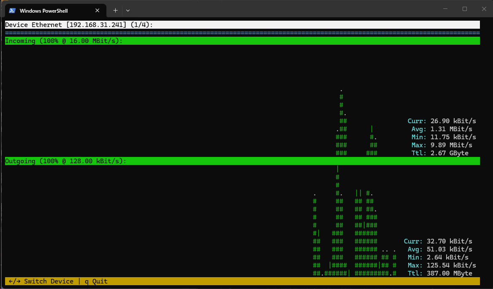
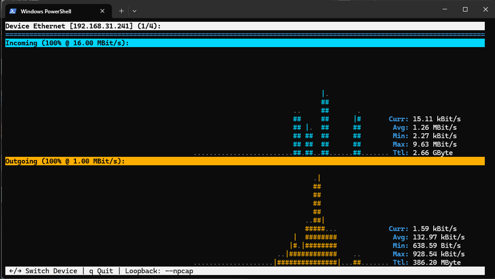

# Winload 

> Linuxの「nload」にインスパイアされた、軽量でリアルタイムなネットワーク帯域幅およびトラフィック監視用CLIツールです。

> **[📖 English](readme.md)**
> **[📖 简体中文(大陸)](readme.zh-cn.md)**
> **[📖 繁體中文(台灣)](readme.zh-tw.md)**
> **[📖 日本語](readme.jp.md)**
> **[📖 한국어](readme.ko.md)**

[](https://github.com/VincentZyuApps/winload)
[](https://gitee.com/vincent-zyu/winload)

[](https://github.com/VincentZyuApps/winload/releases)
[](https://github.com/VincentZyuApps/winload/releases)
[](https://github.com/VincentZyuApps/winload/releases)
[](https://github.com/VincentZyuApps/winload/releases)

[](https://pypi.org/project/winload/)
[](https://www.npmjs.com/package/winload-rust-bin)
[](https://crates.io/crates/winload)

[](https://scoop.sh/#/apps?q=%22https%3A%2F%2Fgithub.com%2FVincentZyuApps%2Fscoop-bucket%22&o=false)
[](https://aur.archlinux.org/packages/winload-rust-bin)
[](https://github.com/VincentZyuApps/winload/releases)
[](https://github.com/VincentZyuApps/winload/releases)

> **[📖 ビルドドキュメント](.github/workflows/build.md)**

## 🚀 はじめに
Winloadは、直感的で視覚的なネットワークモニターをモダンなターミナルにもたらします。もともとはWindowsにおけるnloadの代替ツールとして開発が始まりましたが、現在はLinuxやmacOSもサポートしています。

## 🙏 謝辞
Winloadは、Roland Riegel氏によるクラシックなプロジェクト「nload」にインスパイアされています。素晴らしいアイデアとユーザー体験に深く感謝いたします。
https://github.com/rolandriegel/nload

## ✨ 主な特徴
- **2つの実装エディション**
	- **Rust版**: 高速、メモリ安全、単一の静的バイナリ。日常的な監視に最適です。
	- **Python版**: プロトタイプ作成や統合のために、ハックや拡張が容易です。
- **クロスプラットフォーム**: Windows、Linux、macOS (x64 & ARM64) に対応。
- **リアルタイムの可視化**: 送受信トラフィックのライブグラフとスループット統計を表示。
- **ミニマルなUI**: nloadの使い勝手を踏襲したクリーンなTUI（テキストユーザインターフェース）。

## 📥 Python 版 インストール
> 💡 **実装に関する注記**: PyPI および GitHub/Gitee のソースコードのみが Python 版です。  
> Cargo のみが Rust ソースコードのローカルビルドを提供します。  
> すべて他方のパッケージマネージャー（Scoop、AUR、npm、APT、RPM）および GitHub Releases は **Rust バイナリ** を提供しています。
### Python (pip)
```bash
pip install winload
```

## 📥 Rust 版 インストール（推奨）
### npm (クロスプラットフォーム)
```bash
npm install -g winload-rust-bin
# または npx を直接使用
npx winload-rust-bin
```
> 6つのプリコンパイル済みバイナリを含む：x86_64 & ARM64 対応、Windows・Linux・macOS に対応。

### Cargo (ソースからビルド)
```bash
cargo install winload
```
### Windows (Scoop)
```powershell
scoop bucket add vincentzyu https://github.com/VincentZyuApps/scoop-bucket
scoop install winload
```

### Arch Linux (AUR):
```bash
paru -S winload-bin
```

### Linux (ワンライナー)
> Debian/Ubuntu およびその派生版（Linux Mint, Pop!_OS, Deepin, UOS等）をサポート (apt)

> Fedora/RHEL およびその派生版（Rocky Linux, AlmaLinux, CentOS Stream等）をサポート (dnf)
```bash
curl -fsSL https://raw.githubusercontent.com/VincentZyuApps/winload/main/docs/install_scripts/install.sh | bash
```
> 📄 [インストールスクリプトのソースを表示](https://github.com/VincentZyuApps/winload/blob/main/docs/install_scripts/install.sh)

<details>
<summary>手動インストール</summary>

**DEB (Debian/Ubuntu):**
```bash
# GitHub Releasesから最新の .deb をダウンロード
sudo dpkg -i ./winload_*_amd64.deb
# または apt を使用（依存関係を自動解決）
sudo apt install ./winload_*_amd64.deb
```

**RPM (Fedora/RHEL):**
```bash
sudo dnf install ./winload-*-1.x86_64.rpm
```

**または、[GitHub Releases](https://github.com/VincentZyuApps/winload/releases) からバイナリを直接ダウンロードしてください。**

</details>

## ⌨️ 使い方

```bash
winload              # すべてのアクティブなネットワークインターフェースを監視
winload -t 200       # 更新間隔を200ミリ秒に設定
winload -d "Wi-Fi"   # 特定のデバイス名で開始
winload -e           # 絵文字装飾を有効にする 🎉
winload --npcap      # 127.0.0.1 ループバックトラフィックをキャプチャ (Windows, Npcapが必要)
```

### オプション

| フラグ | 説明 | デフォルト |
|------|-------------|---------|
| `-t`, `--interval <MS>` | 更新間隔（ミリ秒） | `500` |
| `-a`, `--average <SEC>` | 平均値計算のウィンドウ時間（秒） | `300` |
| `-d`, `--device <NAME>` | デフォルトのデバイス名（部分一致可） | — |
| `-e`, `--emoji` | TUIで絵文字装飾を有効にする 🎉 | オフ |
| `-U`, `--unicode` | グラフにUnicodeブロック文字を使用 (█▓░·) | オフ |
| `-u`, `--unit <UNIT>` | 表示単位: `bit` または `byte` | `bit` |
| `-b`, `--bar-style <STYLE>` | バースタイル: `fill`, `color`, `plain` | `fill` |
| `--in-color <HEX>` | 受信グラフの色、16進数RGB (例: `0x00d7ff`) | シアン |
| `--out-color <HEX>` | 送信グラフの色、16進数RGB (例: `0xffaf00`) | ゴールド |
| `-m`, `--max <VALUE>` | Y軸の最大値を固定 (例: `10M`, `1G`, `500K`) | 自動 |
| `-n`, `--no-graph` | グラフを非表示にし、統計のみを表示 | オフ |
| `--hide-separator` | 区切り線（イコール記号の行）を非表示にする | オフ |
| `--no-color` | すべてのTUIカラーを無効にする（モノクロモード） | オフ |
| `--npcap` | **[Windows Rust版のみ]** Npcap経由でループバックをキャプチャ | オフ |
| `--debug-info` | **[Rust版のみ]** インターフェースのデバッグ情報を表示して終了 | — |
| `-h`, `--help` | ヘルプを表示 (`--help --emoji` で絵文字版ヘルプ！) | — |
| `-V`, `--version` | **[Rust版のみ]** バージョンを表示 | — |

### キーボードショートカット

| キー | アクション |
|-----|--------|
| `←` / `→` または `↑` / `↓` | ネットワークデバイスを切り替える |
| `=` | 区切り線の表示/非表示を切り替える |
| `c` | カラーのオン/オフを切り替える |
| `q` / `Esc` | 終了 |

## 🪟 Windows ループバック (127.0.0.1) について

Windowsの標準的なAPIでは、ループバックトラフィックを正しく報告できません。これは[Windowsのネットワークスタックにおける機能的な制限](docs/win_loopback.md)によるものです。

**Windowsでループバックトラフィックをキャプチャする場合**は、`--npcap` フラグを使用してください：

```bash
winload --npcap
```

これには、セットアップ時に「Support loopback traffic capture（ループバックトラフィックキャプチャのサポート）」を有効にして [Npcap](https://npcap.com/#download) をインストールする必要があります。

> 以前、Windows独自の `GetIfEntry` APIを直接ポーリングする方法を試みましたが、ループバックのカウンタは常に0でした。ループバックの疑似インターフェースの背後には、カウントを行うためのNDISドライバが存在しないためです。そのため、そのコードパスは削除されました。

> 📖 なぜWindowsのループバックが制限されているのかについての詳細は、[docs/win_loopback.md](docs/win_loopback.md) を参照してください。

LinuxおよびmacOSでは、ループバックトラフィックは追加のフラグなしで標準で動作します。

## 🖼️ プレビュー
#### Python版 プレビュー


#### Rust版 プレビュー

